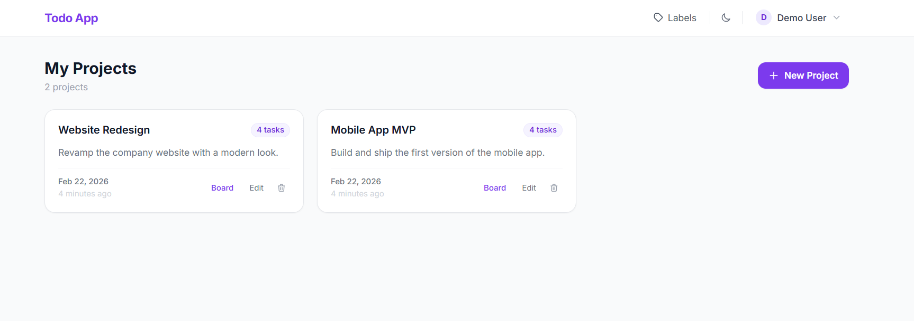
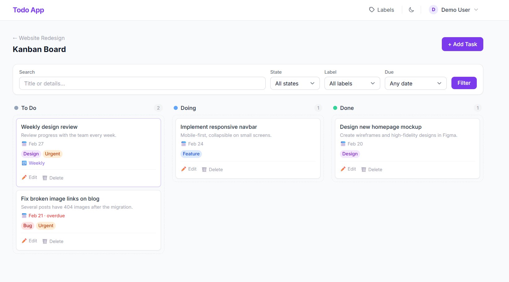
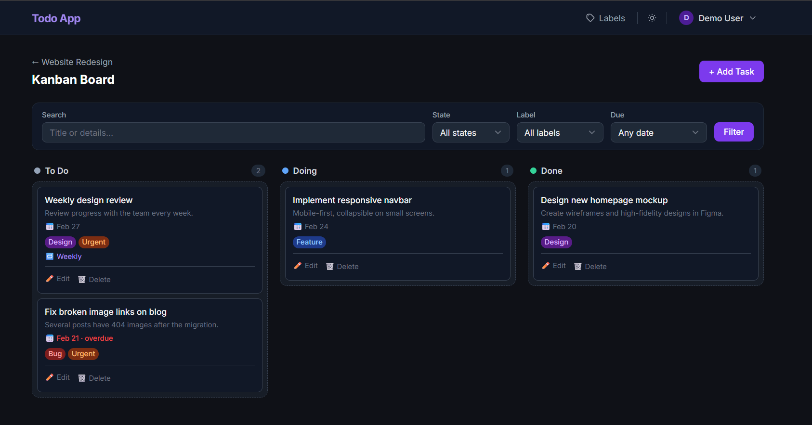

# Todo App

A clean project and task management app built with Laravel. Supports kanban boards,
recurring tasks, labels, dark mode, and per-project activity logs.

---

## Features

- Projects with kanban boards (To Do / Doing / Done)
- Drag-and-drop task cards via SortableJS — no page reload
- Recurring tasks (daily / weekly / monthly) — completing one auto-spawns the next
- Labels with colors — attach multiple per task
- Due dates with overdue highlighting
- Filter tasks by state, label, or due date bucket
- Activity log per project (latest 20 events)
- Full dark mode — persists across sessions, zero flash on navigation
- Auth (register, login, forgot password, profile) via Laravel Breeze

---

## Tech Stack

| Layer       | Choice                              |
| ----------- | ----------------------------------- |
| Framework   | Laravel 11                          |
| Auth        | Laravel Breeze                      |
| Frontend    | Blade + Tailwind CSS v3 + Alpine.js |
| Drag & Drop | SortableJS                          |
| Database    | SQLite (local) / MySQL (production) |

---

## Setup

Must Run each command in order:

```bash
git clone https://github.com/mohammed-salem-dev/todo-app

cd todo-app

cp .env.example .env

composer install

php artisan key:generate

# Run migrations / it may ask a question to create a database.sqlite, answer with yes
php artisan migrate --seed

# Seed demo data (optional)
php artisan db:seed

# Install and build frontend assets
npm install

npm run build

# Start dev server
php artisan serve
```

Visit `http://localhost:8000`

---

## Default Login (after seeding)

```
If You don't want to use it, just hit the register button and create an account.
Email:    demo@example.com
Password: password
```

The seeder creates:

- 1 user
- 2 projects (Website Redesign, Mobile App MVP)
- 8 tasks across both projects — mix of todo, doing, done
- 4 labels: Bug (red), Feature (blue), Urgent (orange), Design (purple)
- 2 intentionally overdue tasks for demo purposes
- 1 weekly recurring task, 1 daily recurring task

## Screenshots

| My Projects                           | Kanban Board                    | Dark Mode                     |
| ------------------------------------- | ------------------------------- | ----------------------------- |
|  |  |  |

---

## License

MIT
